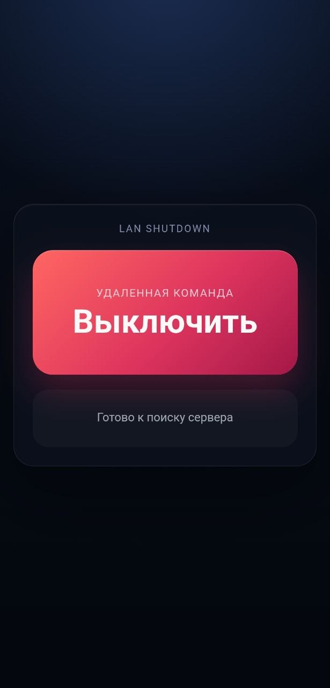

# PC Shutdown

Простое приложение для выключения ПК с Android телефона в локальной сети.

## Скачать

- **Для ПК:** [RemoteOff.exe](https://github.com/r1cew/pc-shutdown/releases/download/1.0/RemoteOff.exe)
- **Для Android:** [RemoteOff-ARM64-v8a.apk](https://github.com/r1cew/pc-shutdown/releases/download/1.0/RemoteOff-ARM64-v8a.apk)

## ПК установка

1. Скачайте `RemoteOff.exe`
2. Запустите файл
3. Для автозапуска нажмите `Win + R`
4. Введите `shell:startup` и нажмите Enter
5. Переместите `RemoteOff.exe` в открывшуюся папку

> **Примечание:** Сервер работает в фоне без окна.

## Android установка

Установите `RemoteOff-ARM64-v8a.apk`

## Скриншоты

  

